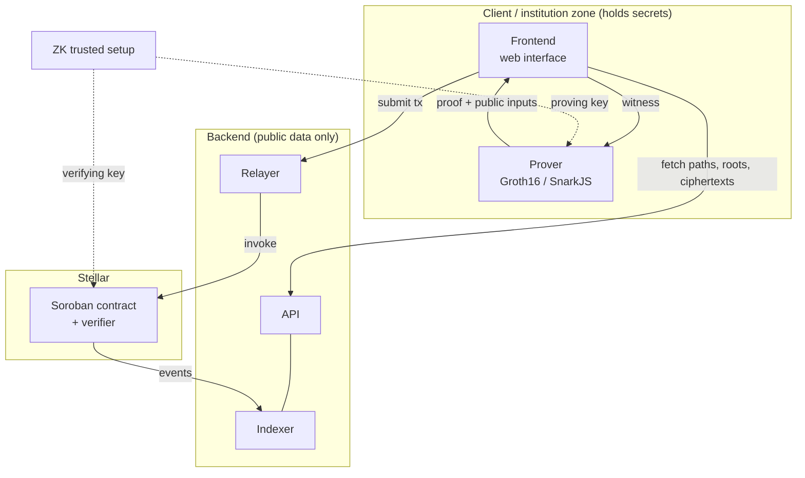

# Finnes: System Architecture

Confidential settlement layer for regulated RWA on Stellar. This document describes
the **system architecture**: the components, their responsibilities, and how they
interact. For the product overview see [`README.md`](./README.md); for build and
coding conventions see [`CLAUDE.md`](./CLAUDE.md). Detailed circuit constraints and
contract internals live in the `circuits/` and `contracts/` source.

---

## Overview

Finnes is split into four tiers. The guiding principle is a **trust boundary**:
all secrets (spending keys, viewing keys, and the proof witness) stay inside the
client/institution zone. The shared backend and the chain only ever see public
data: commitments, nullifiers, ciphertexts, roots, and proofs.

---

## Frontend

The institution-facing web interface. The only place, besides the prover, where
private keys exist.

- Web app (React / Next.js + TypeScript) served as the primary user interface.
- Connects a Stellar wallet (e.g. Freighter) for the transparent side: signing and
  submitting `shield` / `unshield` transactions.
- Local key & note management: the spending key and viewing key are generated and
  held client side; the app scans on chain ciphertexts and trial-decrypts them to
  discover owned notes and confidential balances.
- Builds confidential-transfer and DvP-settlement intents, then hands the witness
  to the prover. It never sends private data to the shared backend.
- Two role-based views:
  - **Institution view**: confidential balances, send a confidential transfer,
    run a DvP settlement, see KYC/limit status.
  - **Regulator / auditor view**: uses the auditor view key to decrypt and inspect
    transactions for audit.
- Shows each user only what they are entitled to see; nothing about other parties.

---

## Backend

Off chain services that handle the heavy read side. Stateless with respect to
secrets. It touches only public chain data and never holds spending or viewing
keys.

- **Indexer**: subscribes to contract events, reconstructs the commitment Merkle
  tree off chain, tracks the nullifier set and the recent-roots ring buffer, and
  stores ciphertexts for client scanning.
- **API**: serves Merkle inclusion paths, current/recent roots, compliance roots
  (KYC and sanctions), and encrypted-note blobs so clients stay lightweight. For
  the demo, KYC enrollment is **mocked**: an admin script enrolls all demo accounts
  into `kyc_root` and the API serves a KYC path for any enrolled address, so a
  sender can prove a recipient's membership without a real identity provider.
  (Recipient-KYC privacy is a production concern, deferred.)
- **Relayer** (optional): submits transactions on behalf of users via a Stellar
  **fee-bump** transaction: the relayer's account pays the XLM network fee, so a
  user needs no XLM-funded account and their identity is not linked to a
  confidential transfer. Relayer compensation (when charged) is a per asset `fee`
  term in the shielded asset, carried in the circuit/public-IO but **0 in the
  demo**.
- The prover is **not** part of the shared backend (that would leak the witness).
  If browser proving is too heavy, an institution may run its own prover node
  inside its own trust zone, never as a shared multi-tenant service.

---

## Contract

The on chain settlement state machine and proof verifier on Soroban (Rust / WASM).

- Entrypoints: `shield` (transparent → shielded), `confidential_transfer`
  (shielded → shielded), `settle_dvp` (atomic two-asset), `unshield`
  (shielded → transparent), and admin functions (update KYC/sanctions roots,
  freeze/clawback via the frozen-commitment set).
- State: the commitment Merkle tree (root + frontier), the nullifier set, the
  compliance roots (KYC, sanctions, **and the issuer-managed frozen-commitment
  root**), the auditor public key, the issuer authority key, the **authorized-assets
  registry root (`assets_root`)**, and the Groth16 verifying keys (one per circuit).
- Verifies proofs using the BLS12-381 host functions (CAP-0059, Protocol 22/23).
- Performs **no hashing**: the circuit proves the Merkle transition and outputs the
  new `(frontier, root)`, which the contract stores verbatim. The contract only
  runs the pairing-check and writes storage, no Poseidon on chain.
- Enforces a strict order on every transfer: validate the commitment root (against
  a recent-roots window) → check nullifiers are unused → check compliance roots
  match state (**`frozen_root` strict; `kyc_root`/`sanction_root` windowed**) →
  verify the Groth16 proof (which binds the auditor ciphertexts as public inputs
  and proves frozen-set non membership of every spent note) → store the new
  frontier/root and nullifiers → only then is state fully mutated.
- Atomicity: a Soroban transaction executes all-or-nothing. A same-party demo DvP
  settles in a single invocation; cross-institution DvP in production uses an
  **escrow / two phase** flow (see *Settlement (DvP)*) rather than a single
  combined witness.
- Emits events (new commitments, nullifiers, ciphertext references) that the
  indexer consumes.

---

## ZK

The zero-knowledge layer: circuits and the proving system that make confidentiality
and in circuit compliance possible.

- **Circuits** (Circom, `--prime bls12381`): `shield`, `transfer`, `unshield`, and
  `dvp` (each with its own VK), composed from reusable sub-circuits: note
  commitment, nullifier derivation, Merkle inclusion, Merkle-transition
  (`old_frontier → new_frontier, new_root`), value range checks, authorized-assets
  membership, KYC membership, sanctions **and frozen-set** non membership, and
  auditor-encryption well-formedness. `shield` and `unshield` are transfer variants
  (no shielded inputs / transparent-revealing output respectively). Same gadgets,
  no new crypto. All gadgets are BLS-native: the **only**
  in circuit cryptographic primitive is Poseidon over the BLS12-381 scalar field
  (plus field-agnostic range/bit checks). There is **no embedded curve** and **no
  in circuit signature**.
- **Proof system**: Groth16 over the BLS12-381 curve, single pairing-check
  verification, the cheapest option on Soroban (~40M instructions).
- **Prover**: runs inside the client/institution zone (browser WASM or a
  self-hosted node). It takes the private witness plus the proving key and produces
  a proof and public inputs. Private data never leaves this zone.
- **Trusted setup**: a universal phase-1 (Powers of Tau) plus a per-circuit phase-2
  ceremony, producing the proving keys (`.zkey`) and the verifying keys (VK). The
  VK is embedded in the contract; the proving key is used by the prover.
- **Toolchain**: Circom and SnarkJS; the VK is translated into the Soroban verifier
  (based on `stellar/soroban-examples/groth16_verifier`).
- **Poseidon parity**: a single parameter set generated for the BLS12-381 scalar
  field `r`, mirrored across exactly two surfaces, the circuit and the JS/TS
  SDK/prover (never the contract). A cross-implementation test vector is a CI gate;
  circomlibjs' default (BN254) Poseidon must not be used.
- **Public-IO**: recent commitment root, nullifiers, output commitments, compliance
  roots (incl. `assets_root` and `frozen_root`), auditor ciphertexts (bound directly as public
  inputs), and the frontier transition (`old_frontier` in, `new_frontier`/`new_root`
  out). Each public input costs one G1 scalar-mul in the verifier, so the set is
  kept tight and measured early with `simulateTransaction`.

---

## End-to-end flow (confidential transfer)

1. The frontend assembles the intent and witness from the user's local notes, and
   fetches the Merkle path, a recent root, and the compliance roots from the API.
2. The prover (client zone) generates a Groth16 proof and public inputs.
3. The frontend (or the relayer) submits the transaction to the contract with the
   proof, public inputs, and the recipient + auditor ciphertexts.
4. The contract verifies everything and updates state atomically, then emits events.
5. The indexer ingests the events and updates the off chain tree and ciphertext store.
6. The recipient's frontend scans the new ciphertexts and discovers the incoming note.
7. The regulator's frontend, using the auditor view key, can decrypt the auditor
   ciphertext to audit the transaction.

---

## Settlement (DvP)

DvP exchanges two assets (e.g. a tokenized security against confidential cash)
without either party revealing its spending key to the other. There is a hard
constraint behind the design: a sound nullifier is derived from the owner's
spending key, so a *single* combined proof would need both parties' secrets in one
witness. We avoid that.

- **Production: escrow / two phase.** Each party first does an ordinary
  single-party spend of its own note into an *escrow note* owned by the settlement
  intent (owner = the intent, not A or B). Because each leg's nullifier is derived
  from its own owner's secret, both spends are sound with **no shared key
  material**. A settlement step then spends both escrow notes (whose authority
  belongs to the intent/contract, not to any party's secret) and mints the swapped
  outputs (security → B, cash → A). Atomicity is *atomic-via-escrow* with a timeout
  refund (HTLC / DvP-CCP style); the only leak is that "an intent of some size
  exists", which institutions accept.
- **Demo: single combined proof.** One witness holds both parties' secrets and
  produces one proof (one pairing). This is acceptable **only** because a test
  harness controls both keypairs; it does not demonstrate the no-key-sharing
  property and is **not** the production model. Label it as such wherever shown.
- Counterparty consent in both models is on chain via `require_auth` (native
  Ed25519) over a transaction that commits to the concrete intent (output
  commitments, nonce), never an in circuit signature.

---

## Clawback & freeze

Shielded clawback is enforced in circuit via an issuer-managed **frozen-commitment
set** (a separate root). Every spend proves **non membership** of each spent
commitment against `frozen_root`, reusing the sanctions non membership gadget, so
a frozen note simply becomes unspendable. Computing a note's nullifier to clawback
it is impossible: that needs the owner's spending key, which no authority holds.

Clawback is deliberately **two phase, two key**, which makes the one place that
joins the otherwise-separated read and write authorities explicit and auditable:

1. **Read (auditor).** The auditor uses the view key off chain to decrypt and
   derive the target commitment `cm_target`.
2. **Write (issuer).** `issuer_authority` adds `cm_target` to the frozen set and
   mints a recovery note. The freeze transaction may require *both* signatures
   (auditor attests "this `cm` is the target", issuer authorizes).

`frozen_root` is checked **strictly** against current state on every transfer
(immediacy is the point of clawback). Only `issuer_authority` can change it, so the
liveness cost of invalidating in-flight proofs is bounded and non-adversarial.
Affected provers simply detect the change via the API and re-prove against the new
root.

---

## Assets registry & boundary (shield / unshield)

A single **authorized-assets registry** is the source of truth for what may be
shielded and on what terms. Each leaf is `(asset_id, sac_address, decimals,
per_tx_limit_raw)`, committed as `assets_root` (a public input matched to state).
`asset_id = Poseidon(sac_address)`, so asset identity is self-binding. This one
registry collapses asset-binding and per asset limits into a single membership
mechanism.

- **Raw units only.** Notes store the asset's raw SAC amount; circuits never
  rescale. Decimals live only in the registry and the SDK (display), so decimal
  heterogeneity never enters the ZK layer.
- **Per asset limits via membership.** A transfer proves membership of
  `(asset_id, …, per_tx_limit_raw)` against `assets_root` and checks
  `value ≤ per_tx_limit_raw`. The limit arrives as a witness, never as a per asset
  public input. Exposing it would fingerprint the otherwise-hidden asset. Notional
  cross-asset limits ("max $10M/transfer") need a price oracle and are out of scope;
  admins set `per_tx_limit_raw` to reflect notional off chain. For DvP the check is
  per-leg.
- **Shield** (transparent → shielded) = a transfer with no shielded inputs and one
  transparent input. `(asset_id, amount)` are public; the proof shows the new
  commitment opens to them without revealing `(owner, rho, r)` (not a full opening,
  which would de-anonymize the note at birth). Reuses the output-commitment +
  auditor-encryption logic, no new crypto.
- **Unshield** (shielded → transparent) = a transfer that reveals
  `(asset_id, amount, recipient)` so the contract can call the SAC `transfer`. On
  top of the usual inclusion / nullifier / KYC constraints it MUST enforce a
  compliant transparent recipient **and frozen-set non membership**, closing the
  escape hatch where a frozen note could exit the shielded domain. Revealing
  `asset_id` / `amount` here is inherent to leaving for the transparent layer.

---

## Trust boundaries

- **Client / institution zone** (private): spending key, viewing key, note
  plaintext, witness, and the prover.
- **Auditor zone**: the auditor view secret, held by the regulator (or a threshold
  set of authorities).
- **Public** (shared backend + chain): commitments, nullifiers, ciphertexts, roots,
  proofs, and the verifying key.
- The backend is untrusted for confidentiality. It only ever sees public data.

---

## Roles

- **Institution user**: sends and receives confidential transfers and settlements.
- **Regulator / auditor**: holds the view key (**read** authority); can decrypt
  and audit all transactions.
- **Issuer / admin**: holds `issuer_authority` (**write** authority); updates
  compliance roots and freezes/clawbacks via the frozen-commitment set.

These two powers are kept as distinct keys even when one operator runs both in a
demo. Clawback is the single operation that needs them together (see *Clawback &
freeze*).

---

## Tech stack summary

| Tier | Stack |
|---|---|
| Frontend | React / Next.js, TypeScript, Stellar SDK, Freighter |
| Backend | Node.js / TypeScript indexer + API + optional relayer |
| Contract | Soroban (Rust / WASM), BLS12-381 host functions |
| ZK | Circom (`--prime bls12381`), Groth16, Poseidon-BLS, SnarkJS (no embedded curve) |